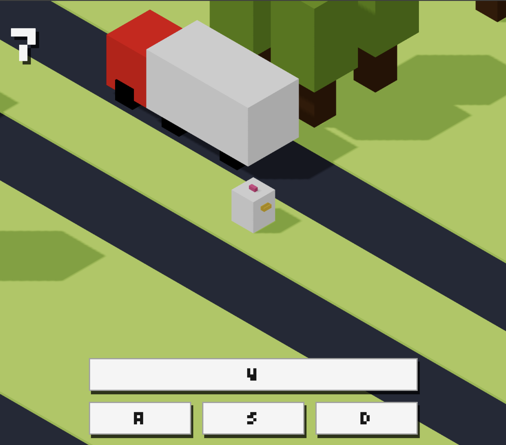

# Crossy Road (React + Three + Vite)

> Inspired by: https://www.youtube.com/watch?v=ccYrSACDNsw

Overview
--------
This is a small Crossy-Road–style demo implemented with React and a React-friendly Three.js renderer. The project demonstrates how to build an interactive 3D scene in the browser using `@react-three/fiber`, manage simple game state in React, and animate objects with `gsap`. It was bootstrapped with Vite for a fast development experience.

The app places a player on a tile grid and procedurally generates rows (grass, forest with trees, and roads with moving vehicles). Your goal is to move the player forward across the rows while avoiding vehicles and trees.

Technology stack
----------------
- React 19 — UI and component model
- Vite — dev server and bundling
- three.js — 3D engine
- @react-three/fiber — React renderer for three.js
- @react-three/drei — useful helpers for Three + React
- Tailwind CSS — utility-first styling for UI overlays
- GSAP — animations and tweens for smooth motion
- gh-pages — optional deploy script (in `package.json`)

All dependencies are declared in `package.json`.

How it works (high level)
-------------------------
- The React app mounts a `Canvas` from `@react-three/fiber` which provides the WebGL context and camera.
- Scene elements (player, rows, trees, vehicles) are React components that create three.js meshes.
- The player is parented to the camera so the camera follows the player.
- Input (W/A/S/D or arrow keys) is captured and published into a tiny player store; `usePlayerAnimation` consumes the move and runs a `gsap` timeline to animate the player across tiles.
- Road rows spawn vehicles that run a looping `gsap` animation. Each vehicle also runs a per-frame bounding-box collision check against the player.
- When a collision occurs the `game` context is set to the `over` state and the UI shows a Game Over overlay with a retry option.
- Rows are generated procedurally on demand; moving forward close to the end of the generated rows triggers generation of more rows.

Run it locally
--------------
Prerequisites: Node.js (LTS recommended) and npm (or your package manager of choice).

1. Install dependencies:
   - `npm install`

2. Start the development server with HMR:
   - `npm run dev`
   - Open the URL printed by Vite (typically `http://localhost:5173`).

3. Build for production:
   - `npm run build`

4. Preview the production build:
   - `npm run preview`

5. Deploy to GitHub Pages (optional):
   - `npm run deploy`  
   Note: `npm run deploy` uses `gh-pages` to publish the `dist` folder. If you plan to use it, ensure `homepage` is set correctly in `package.json`.

Project layout (key files)
--------------------------
- `src/main.jsx` — app bootstrap and root render
- `src/App.jsx` — composition of `GameProvider`, `Scene`, `Player`, `Map`, and `Interface`
- `src/components/Scene.jsx` — `Canvas` and camera setup
- `src/components/Player.jsx` — player mesh, light, and camera parenting
- `src/hooks/usePlayerAnimation.js` — input handling, movement validation, and jump/rotation animation via GSAP
- `src/hooks/useEventListeners.js` — keyboard event listeners (W/A/S/D and arrows)
- `src/stores/player.js` — small player store (`getMove`, `setMove`, `playerRef`)
- `src/stores/game.jsx` — game context (rows, score, gameState, `generateRows`, `reset`)
- `src/components/Map.jsx` / `src/components/Row.jsx` — row mounting and row-type dispatch (`grass`, `forest`, `road`)
- `src/components/*` — `Grass`, `Forest`, `Road`, `Tree`, `Vehicle`, `Car`, `Truck`, `Wheel`
- `src/hooks/useVehicleAnimation.js` — GSAP-based looped vehicle motion
- `src/hooks/useHitDetection.js` — per-frame Box3 collision checks between vehicles and player
- `src/constants.js` — `tileSize`, `minTileIndex`, `maxTileIndex`, etc.

Short developer guide — where to change common things
-----------------------------------------------------
Below are the common edits you will make and where to find them.

1. Change the grid / tile scale
   - File: `src/constants.js`  
     Edit `tileSize` to scale spacing, movement distance and scene tiling. Larger values increase distance between tiles.

2. Tweak player behavior and animation
   - Files:
     - `src/hooks/usePlayerAnimation.js` — movement rules, jump z-offset, animation durations and rotation are here. The hook reads `getMove()` from the player store, checks for obstacles, updates score, triggers `generateRows`, and runs GSAP timelines for the actual motion.
     - `src/hooks/useEventListeners.js` — keyboard bindings. Modify or extend this to add custom keys or touch controls.

3. Adjust vehicle speed and density
   - File: `src/stores/game.jsx` — the row generator (`generateRow`) randomly creates `road` rows and populates `rowData.vehicles` with `type`, `initialTileIndex`, and `color`. It also sets `rowData.speed`.
   - Lower `rowData.speed` to make vehicles traverse rows faster (duration in GSAP). Increase the number of generated vehicles to increase density.

4. Change collision detection
   - File: `src/hooks/useHitDetection.js` — uses `Box3().setFromObject(...)` to compute bounding boxes and checks `intersectsBox`. If you prefer circle-based collisions, replace this logic with distance checks between centers and a radius.

5. Add new vehicle or obstacle types
   - Add a new component under `src/components/` (for example `Bus.jsx`).
   -
 Update `src/components/Vehicle.jsx` to include your new type in the switch/return logic.
   - Update `generateRow` inside `src/stores/game.jsx` to randomly choose your new vehicle type.

Helpful tips and conventions
----------------------------
- Movement is discrete and grid-based; the system avoids a heavy physics engine to keep the logic readable and deterministic.
- Animations use `gsap` for predictable timings and easy looping. Vehicle loops use `repeat: -1`.
- For continuous motion or per-frame logic, prefer `useFrame` from `@react-three/fiber`. Keep heavy computations out of render functions to avoid frame jank.
- The camera is parented to the player group (`Player.jsx`) so it moves naturally with the player; change this if you need different camera behavior.
- `useFrame` and per-frame hooks run at animation frame rate — avoid expensive synchronous work inside them.

Debugging and development workflow
----------------------------------
- Use the `Stats` panel mounted in `src/components/Scene.jsx` while developing to monitor render stats and performance.
- If you need deterministic behavior for testing, temporarily make row generation deterministic by hard-coding row data or seeding the generator logic.
- Insert `console.log` statements in `useFrame` callbacks or the `generateRow` path to trace runtime behavior; remember to remove or gate them to avoid heavy logging.
- Keep separate concerns: rendering/meshes in `components/`, animation hooks in `hooks/`, and game state in `stores/`.
